[](#install)
[](.github/workflows/self-test.yml)
[](LICENSE)
[](PRIVACY.md)

**[Install](#install)** · **[What you get](#what-you-get)** · **[The script](#the-script)** · **[Privacy](#privacy)** · **[The Cairn family](#the-cairn-family)**

**Your coding agent says "fixed, tested, all green". Cairn Verify checks each of those words
against the repository and tells you, in plain language, which ones are true.**

The agent's report is a list of claims, and if you don't read code you can't tell which
ones hold. They're rarely lies. They're claims nothing enforces:

- **A fix in a file the app never runs.** There are two copies of the session code; the
  agent fixed the old one, wrote a test against the old one, and the test passes. Users
  still get logged out.
- **"All tests pass", because the failing test stopped running.** A new line in the test
  config leaves it out, and there's no skip marker anywhere to notice.
- **"Removed unused code" that wasn't unused.** Another file still loads it, and the test
  that would have caught that was deleted in the same commit.
- **"No behaviour change", after the expected value in a test was edited.**
- **"Wired into checkout", and nothing calls it.**

Cairn Verify is a skill for Claude Code. It splits the agent's commits, PR description or
chat summary into claims, checks each one, and gives it a verdict: **holds**, **doesn't
hold**, or **can't tell**, with the one command that would settle it.


*Real output, from a small made-up app whose agent overclaims.*

## Who it's for

If you build with Claude Code, Cursor or Codex and can't read every diff (or don't have
time to), you have probably seen one of these:

- The agent says "done", and the same bug is back a week later.
- The tests are green and the feature is still broken.
- It has "fixed" the same thing three times.
- There are two files with the same name, and nobody's sure which one the app uses.

None of this means the agent is useless. It means its report and the repository have
drifted apart. You don't need to read the code to find out where. Ask in plain words:

- *"My agent says it fixed the login bug and all tests pass. Can I trust it and merge?"*
- *"Claude has fixed this bug three times and it's still broken. What's going on?"*
- *"I inherited an app built with Cursor. Which of these two auth files is the real one?"*
- *"Check what the agent claimed in this PR before I merge it."*

## What you get


| | |
|---|---|
| **A verdict for every claim** | A table of what the agent said, whether it holds, what's actually true, and the evidence, written for someone who doesn't read code. |
| **Proof that could have failed** | A fix counts when a test fails before it and passes after it, run in a separate worktree at both commits. A test counts when breaking the code makes it fail. |
| **A message to paste to the agent** | For each claim that doesn't hold: what to do, and what proof to bring back. |
| **An agent that stops going in circles** | Finds which of two look-alike files the app actually runs, dead code that's only kept alive by other dead code (in rounds), and code only tests reach. Then it writes the `CLAUDE.md` / `AGENTS.md` rules that stop the loop. |
| **A 0–10 score** | How trustworthy the agent's reporting was on this branch, with evidence for every point. |

## How it compares

| Need | Use |
|---|---|
| A general code-quality review of a PR | Anthropic's `pr-review-toolkit` or `/code-review` |
| Security review | `security-guidance`, `/security-review` |
| **Is what the agent said true?** | **Cairn Verify** |

Code review asks "is this code good?". Cairn Verify asks "did it do what it said?", which is
the question you're left with when you can't read the code yourself.

## Install

```
/plugin marketplace add nicuk/did-ai-really-fix-it
/plugin install cairn-verify@cairn-verify
```

## The script

`skills/verify-agent-claims/scripts/verify_claims.py` has two commands.

```
python skills/verify-agent-claims/scripts/verify_claims.py --self-test
python skills/verify-agent-claims/scripts/verify_claims.py claims --repo . --range main..HEAD [--text summary.txt] [--markdown]
python skills/verify-agent-claims/scripts/verify_claims.py orphans --repo . [--entry "workers/*.py"] [--smoke "npm run build"]
```

- **`claims`** checks each commit's message against that commit's own diff, and a PR
  description or agent summary against the whole range. A range-wide diff alone would hide
  an edit that a later commit undid. `--markdown` prints a table for a PR comment.
- **`orphans`** builds the import graph for JS/TS and Python and reports dead files in
  rounds, twins with the reachable copy named, files only a path string mentions, and code
  kept alive only by tests. It reads import aliases from `tsconfig.json` / `jsconfig.json`
  by itself, and in a monorepo it finds each app and package (Next.js, SvelteKit, Nuxt, Vite,
  Astro, Storybook, Python `src/` packages) and applies its entry conventions there.

It is a locator, not a judge: it marks claims CONTRADICTED, UNPROVEN or NO CONTRADICTION
FOUND, and the skill turns those into verdicts by reading and running the code. It can't
follow an import built from a string at runtime, so `--smoke "COMMAND"` starts the app once
in a temporary worktree of HEAD, outside your checkout, and warns loudly if it doesn't
start. The worktree is removed afterwards, even on a timeout.

To check every pull request, `.github/workflows/verify-claims.yml` runs `claims` on the PR's
commits and description and keeps one comment on the PR up to date. It reports and never
blocks a merge. Other repositories can call it; the file's header has the snippet.

`--self-test` plants one defect for each check in a temporary folder and confirms every
check fires. A check that has never failed has never been tested. The self-test badge at
the top runs it on every push, along with a check that the script imports nothing that can
reach the network.

## What it runs, and what it doesn't

- The script reads files and runs `git log`, `git diff`, `git show`, `git cat-file` and
  `git ls-files` in the repository you name.
- It writes nothing to your project. `--self-test` uses a temporary folder and deletes it.
- It makes no network requests. There's no telemetry and no API key.
- `--smoke` is the one exception to "runs only git": it runs the command you give it, in a
  temporary worktree outside your checkout, and removes that worktree afterwards.
- The optional GitHub Action posts one comment on the pull request through GitHub's API,
  with the workflow's own token, and nothing else.
- When the skill runs your tests to check a claim, it uses a separate `git worktree`, never
  your checked-out branch, mocks paid APIs, runs under a timeout, and never kills processes
  by name.

## Evidence

**Case study:** [The dead auth system that took three rounds to find](https://github.com/nicuk/cairn-principles/blob/main/case-studies/verify-dead-auth-rounds.md).

- **On a real 504-file codebase** built with coding agents, the orphan scan found 21 of
  the 22 dead files the repo's own guard listed as orphans, and the 22nd as a file named but
  never imported, plus 10 more the guard had missed, in under a second. On an honest, carefully written deletion commit from the same repo, the
  claims check found no contradictions.
- **On two made-up apps** built to overclaim (a fix in a dead copy, a test dropped in
  config, a dynamic import broken by a deletion, an unwired feature), runs with and without
  the skill were compared on the same prompts: eight runs, graded against an answer key
  written first. Both found every planted problem. With the skill, every run also proved
  each verdict by running the code at each commit, gave a score, and ended with a message
  to paste to the agent, at about a minute more per run. A strong model can find these
  problems on a small app; the skill makes the check the same every time, and the script
  scales it to a large one.

The incidents behind every check are in `skills/verify-agent-claims/references/incidents.md`.

## Privacy

Nothing is collected. See [PRIVACY.md](PRIVACY.md).

## The Cairn family

Three plugins built on one principle: **a claim with an enforcer stays true; a claim with
only an author rots.** Each one checks a different kind of claim.
[The principles, the evidence and the design decisions](https://github.com/nicuk/cairn-principles) are
in one place.

| Plugin | The question it answers |
|---|---|
| [Cairn Memory](https://github.com/nicuk/claude-md-memory-architecture) | Is what your agents remember cheap to load, and still true? |
| [Cairn Signals](https://github.com/nicuk/llm-silent-failure-audit) | Are the numbers your AI product shows real? |
| **Cairn Verify** (this one) | Did the AI really fix it? |

## Who made this

Built by [Nic Chin](https://nicchin.com/?ref=cairn-verify), who reviews apps built with AI
coding tools. If this check showed that your agent's reports can't be taken at face value,
the rest of the code it wrote may need the same look. That's what the
[AI-Built App Audit](https://nicchin.com/vibe-coded-app-audit?ref=cairn-verify) is for. The
plugin is free and complete either way. Nothing in it is held back.

## License

MIT
